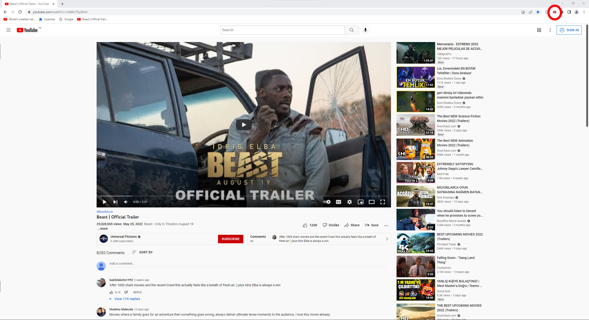
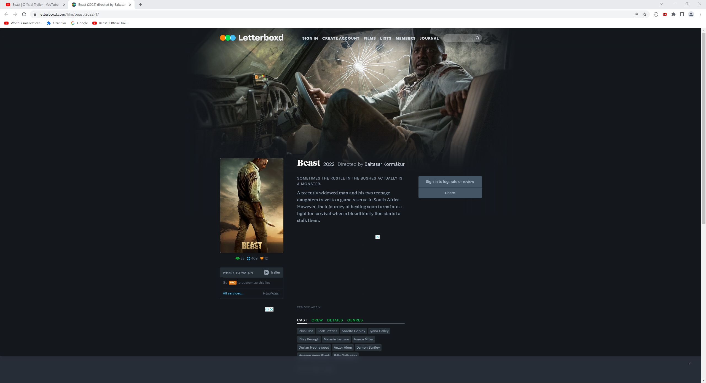

## Open Letterboxd page from youtube trailer

Instead of searching the movie name on the [Letterboxd](https://www.https://letterboxd.com/), just click the icon and the extention will take you to the movie page.

## Screenshots

  

## Contributing
Pull requests are welcome. For major changes, please open an issue first to discuss what you would like to change.

## License
[MIT](https://choosealicense.com/licenses/mit/)
